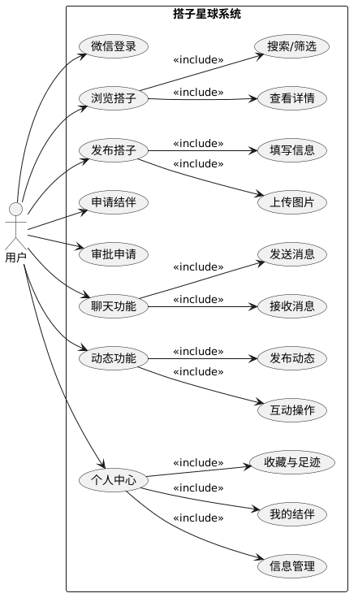
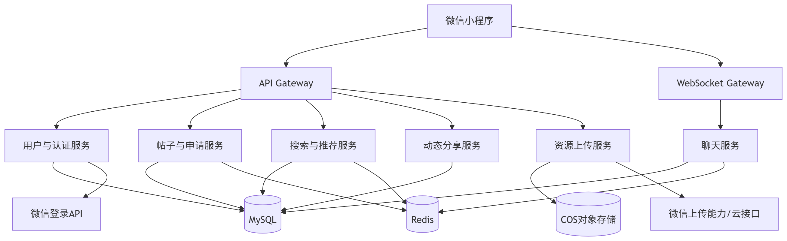
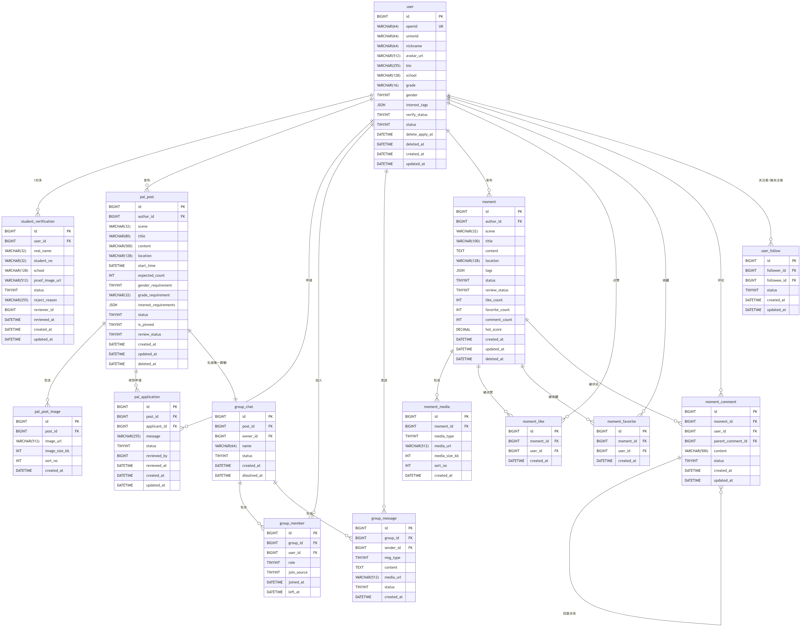

# 系统设计文档

## 一、系统总体描述

### 1. 业务背景与需求摘要

#### 1.1 业务背景

* 随着大学生群体社交方式的变化，围绕“轻社交”“结伴活动”的需求日益增加。在实际生活中，大学生在学习、自习、运动、出行、娱乐等场景中普遍存在找搭子困难的问题，主要表现为兴趣不匹配、时间难协调、场景单一以及缺乏安全保障等。
* 现有社交平台多为泛社交模式，缺乏针对大学生群体的精细化匹配机制，或仅聚焦单一场景（如学习或运动），难以满足多样化的结伴需求。因此，有必要设计一款面向大学生的垂直搭子匹配平台。
* “搭子星球（PalStar）”基于上述需求，提供覆盖学习、生活、娱乐等多场景的搭子匹配服务。系统通过发布搭子需求、筛选匹配、结伴申请、实时沟通等功能，帮助用户快速找到合适的结伴对象，同时结合内容分享与互动功能，提升平台活跃度与用户体验。

#### 1.2 需求摘要

针对上述问题，本系统需要构建一个面向大学生的全场景搭子匹配平台，核心需求包括：

* 支持用户发布各类结伴需求（学习、运动、娱乐等）；
* 提供多维度筛选与匹配功能，提高搭子匹配效率；
* 支持结伴申请与审批，形成完整的结伴流程；
* 提供实时聊天功能，方便用户沟通交流；
* 支持动态分享与互动，增强平台活跃度；
* 提供个人中心管理，记录用户结伴与使用情况。

### 2. 系统目标

#### 2.1 功能目标

系统需实现以下核心功能：

* 用户认证与基础信息管理（基于微信登录）；
* 搭子发布与管理（创建、编辑、关闭结伴帖）；
* 搭子浏览与筛选（多维度筛选与推荐）；
* 结伴申请与审批流程（形成完整业务闭环）；
* 实时聊天与消息通知功能；
* 动态分享与互动（点赞、评论、收藏）；
* 个人中心管理（我的结伴、收藏、足迹等）。

系统功能以“轻量化、核心流程完整”为原则，优先保证主要业务流程可用。

#### 2.2 非功能目标

系统需满足以下非功能性要求：

* 性能目标：在500–1000用户规模下保持系统流畅运行，核心操作响应及时；
* 可用性目标：系统界面简洁，操作路径清晰，核心功能操作步骤不超过3步；
* 安全性目标：基于微信授权登录，保护用户隐私，防止非法访问与数据泄露；
* 稳定性目标：系统运行稳定，无明显卡顿、闪退或服务中断情况；
* 可扩展性目标：支持后续新增功能模块（如匹配优化、推荐机制扩展）；
* 可维护性目标：代码结构清晰，模块划分合理，便于后续维护与迭代开发。

### 3\. 用户群体与用例图

#### 3.1 用户群体

系统主要面向在校大学生，根据使用需求可划分为三类典型用户：

* 社交娱乐型用户：以干饭、逛街、旅行等为主要需求，注重社交体验与氛围；
* 学习成长型用户：以自习、考研、竞赛为目标，强调效率与自律；
* 运动体验型用户：以运动、户外活动为主，关注时间安排与安全性。
* 此外，所有用户在系统中统一作为“平台注册用户”，具备发布、浏览、申请等基本操作权限。

#### 3.2 用例图


### 4\. 约束条件

#### 4.1 技术约束

* 系统基于微信小程序平台开发，需符合小程序开发规范；
* 前后端技术栈采用主流技术（如前端框架+后端服务+ MySQL数据库+Redis数据库）；
* 接口设计需符合RESTful规范，统一数据格式（JSON）；
* 系统需依赖第三方服务（如微信登录、地图服务、内容安全审核接口）；
* 图片上传需符合格式与大小限制（如JPG/PNG，单张≤10MB）。

#### 4.2 法规与安全约束

* 平台内容需符合国家相关法律法规，禁止发布违法违规信息；
* 用户数据需遵循隐私保护原则，不得非法收集或泄露；
* 需提供基本的内容审核机制，过滤不良信息；
* 用户需通过授权登录，避免使用未认证身份进行关键操作。

#### 4.3 资源与项目约束

* 项目为课程设计项目，开发周期有限（约13周），需控制功能复杂度；
* 开发团队规模较小，需优先实现核心功能，避免过度设计；
* 系统定位为原型系统，不涉及大规模商业部署与高并发优化；
* 服务器资源与测试环境有限，性能设计需符合实际条件。

## 二、系统架构设计

### 1\. 架构图

系统采用微服务架构，将不同业务域拆分为独立的服务，通过API Gateway统一对外提供接口，同时支持WebSocket Gateway处理实时通信。

说明：
* 客户端：微信小程序，负责界面交互和用户操作。
* 网关层：API Gateway处理RESTful请求（认证、路由、限流）；WebSocket Gateway维护长连接，处理实时消息。
* 业务服务层：按领域拆分为六个独立服务，各服务通过HTTP或RPC通信（课程设计可简化部署在同一进程，但逻辑上分离）。
* 外部依赖：微信登录API用于获取openid；微信上传能力用于小程序端直接上传图片到COS。
* 数据存储：MySQL存储结构化数据，Redis缓存会话和热点数据，COS存储用户上传的图片/文件。

### 2. 模块划分与职责

根据架构图中的服务拆分，结合之前的功能分区（用户与认证、结伴帖与申请、群聊、攻略帖与互动、预留关注），各模块职责如下：
| 服务名 | 对应数据分区 | 职责描述 | 职责描述 |
| --- | --- | --- | --- |
用户与认证服务|第1区：用户与认证|管理用户基本信息、微信登录、学生认证、个人资料|微信一键登录、JWT签发、学生认证、个人资料CRUD
帖子与申请服务|第2区：结伴帖与申请|处理结伴帖的发布、浏览、筛选、申请、审批|发布/编辑/关闭帖子、按场景筛选、申请加入、审批申请
搜索与推荐服务|第2区（扩展）|提供结伴帖的全文搜索和基于标签的智能推荐|关键词搜索、多维度筛选、热门推荐、个性化推荐（P1）
聊天服务|第3区：群聊|实现用户间的即时通信，包括单聊和群聊（P1）|会话列表、发送/接收消息、历史消息、未读计数
动态分享服务|第4区：攻略帖与互动|管理用户发布的攻略/体验动态，以及点赞、评论、收藏|发布动态、分类浏览、点赞、评论、收藏、取消收藏
资源上传服务|公共|处理图片上传，生成访问URL，对接COS或微信云存储|用户头像上传、结伴帖图片上传、动态图片上传
预留服务|第5区：关注|后续扩展的用户关注、粉丝关系（P1）|关注/取关、粉丝列表、关注动态推送

模块依赖关系：
* 所有服务均依赖用户与认证服务获取用户身份和基本信息。
* 帖子与申请服务与聊天服务独立，通过用户ID关联。
* 搜索与推荐服务依赖帖子与申请服务的数据同步（可采用数据库监听或定时同步）。
* 资源上传服务被其他服务调用，提供统一的文件存储能力。

### 3. 关键技术栈

|技术分类|技术选型|版本|说明|
| --- | --- | --- | --- |
后端语言|Java|11 / 17|主要开发语言
后端框架|Spring Boot|2.7.x|快速构建微服务
实时通信|Netty + WebSocket|-|聊天服务的长连接支持（可简化为轮询）
ORM框架|MyBatis-Plus|3.5.x|数据库访问，简化CRUD
数据库|MySQL|8.0|持久化存储用户、帖子、申请等数据
缓存|Redis|6.x / 7.x|会话管理、JWT黑名单、热点数据缓存
对象存储|腾讯云COS / 阿里云OSS|-|存储用户上传的图片
项目构建|Maven|3.8+|依赖管理和打包
前端平台|微信小程序|基础库 2.x|用户端界面
前端开发工具|微信开发者工具|最新稳定版|编码、调试、预览
版本控制|Git + Gitee|-|代码管理
开发IDE|IntelliJ IDEA|2023+|后端开发

选型说明：
* 微服务拆分：为满足课程设计规模，实际部署可将所有服务合并为一个Spring Boot应用，仅逻辑上保持模块独立，降低部署复杂度。
* WebSocket：若实时性要求不高，可改用前端轮询方式，从而省略WebSocket Gateway。
* COS对象存储：课程设计阶段可使用后端本地存储或直接使用微信小程序自带的云开发存储，减少配置成本。

### 4. 数据库设计
#### 4.1 概述
本系统采用 MySQL 8.0 作为核心持久化存储数据库，围绕「搭子星球」微信小程序的业务场景，完成了从需求分析、概念结构设计、逻辑结构设计到物理结构设计的全流程设计。数据库整体遵循第三范式（3NF），实现数据的低冗余、高一致性，同时通过合理的索引设计、表关联设计，保障系统高并发场景下的读写性能，支撑用户认证、结伴匹配、群聊、动态分享等核心业务的稳定运行。
#### 4.2 数据库概念结构设计（ER 图说明）
本次设计基于系统业务流程，抽象出 13 个核心实体及对应关系，完整覆盖系统所有数据需求，核心实体与关系如下：
* 核心主实体：user（用户）作为系统根实体，关联所有业务实体，是数据流转的核心。
* 用户认证相关实体：student_verification（学生认证），与user为一对一关系，用于存储用户学生身份认证申请与审核数据。
* 结伴业务相关实体：pal_post（结伴帖）、pal_post_image（结伴帖图片）、pal_application（结伴申请），其中user与pal_post为一对多关系（一个用户可发布多个结伴帖），pal_post与pal_application为一对多关系（一个帖子可接收多个申请）。
* 群聊业务相关实体：group_chat（群聊）、group_member（群成员）、group_message（群消息），user与group_chat通过group_member实现多对多关系，group_chat与group_message为一对多关系。
* 动态业务相关实体：moment（动态）、moment_media（动态图片）、moment_like（点赞）、moment_favorite（收藏）、moment_comment（评论），user与moment为一对多关系，moment与点赞、收藏、评论实体分别为一对多关系。
* 扩展业务实体：user_follow（用户关注），用于实现用户关注 / 粉丝关系，为后续功能迭代预留数据支撑。


## 三、功能设计
### 1. 用户认证模块
#### 1.1 功能
* 微信快捷登录：支持微信OAuth2.0静默授权，获取用户OpenID作为唯一标识。首次登录自动创建账号，并记录登录时间、IP等信息。
* 学生身份认证：用户需上传学生证或校园卡照片，后台通过OCR识别与人工审核结合的方式进行核验。认证成功后发放“已认证”标识，并赋予发布结伴帖等核心权限。
* 个人信息管理：支持头像上传（裁剪、压缩）、昵称、性别、年级、兴趣标签等信息的查看与修改。敏感信息（如手机号、学号）修改需二次验证。
* 账号注销：用户提交注销申请后，进入15天冷静期。期间可撤销注销，冷静期结束后删除所有个人数据（匿名化处理，按法规保留日志）。
* 用户等级计算：根据活跃度（登录、发布动态）、互动量（获赞、评论）、认证状态、结伴成功次数等维度，每日定时计算并更新等级。等级影响发布频率、推荐权重等。
* 权限校验：全局拦截器/AOP实现，基于用户角色（未认证/已认证/管理员）和等级，控制接口访问与功能可见性。
  
#### 1.2 模块接口 （I-U）

* I-U-001 用户登录授权接口
* I-U-002 用户信息查询接口
* I-U-003 用户信息修改接口
* I-U-004 学生认证接口
* I-U-005 账号注销接口
* I-U-006 用户等级计算接口

#### 1.3 功能时序
* 登录与认证时序：用户点击微信登录 → 获取code → 后端换取OpenID → 生成JWT token → 返回首页 → 若未认证，引导上传学生证 → 提交审核 → 人工/自动审核 → 更新权限 → 获得发帖/申请资格。
* 账号注销时序：用户申请注销 → 确认操作 → 进入15天冷静期 → 用户可撤销 → 冷静期届满 → 触发数据清理任务 → 账号标记为已注销。

### 2 结伴模块
#### 2.1 功能
* 发布结伴帖：支持选择场景（学习、运动、旅行、自习等），填写标题、时间、地点、人数上限、详细描述，支持图片上传（最多9张）。
* 帖子编辑与状态管理：发布后可编辑内容；支持手动下架/重新上架；结伴开始后自动转为“已结束”状态，不可再申请。
* 多条件筛选搜索：支持按场景、时间范围、地点距离、人数、用户认证状态、发布时间等维度组合筛选。搜索结果支持按热度、时间、距离排序。
* 结伴申请与审批：用户点击“申请加入”，需填写申请理由（选填）。帖子发布者可查看申请列表，支持通过/拒绝；通过后自动创建群聊（调用群聊模块）。
* 我的结伴管理：区分“我发布的”（可管理申请、审批、结束结伴）和“我加入的”（查看状态、退出结伴）。支持申请记录查询及审批状态跟踪。
* 图片上传：集成对象存储服务，上传后返回URL；支持前端预览、压缩、格式校验（jpg/png，单张<5MB）。
  
#### 2.2 模块接口（I-P）

* I-P-001 结伴帖发布
* I-P-002 编辑
* I-P-003 筛选搜索
* I-P-004 详情
* I-P-005 申请结伴
* I-P-006 审批
* I-P-007 我的结伴

#### 2.3 功能时序

* 发帖时序：用户进入发布页 → 选择场景 → 填写信息 → 上传图片 → 安全审核（文本+图片） → 审核通过则发布成功 → 展示在广场列表 → 审核不通过则返回修改意见。
* 找搭子时序：用户进入发现页 → 设置筛选条件 → 请求搜索结果 → 浏览帖子列表 → 点击进入详情 → 提交申请 → 发布者收到通知 → 发布者审批 → 若通过，系统自动创建并拉入群聊 → 双方可在群聊沟通。

### 3. 群聊模块
#### 3.1 功能
* 自动建群：结伴申请通过时，系统调用群聊服务自动创建群组，群名默认格式“【结伴】+场景+时间”，并将结伴发起人与申请人自动拉入群聊。
* 群消息收发：支持文本、图片（缩略图+原图）、系统提示消息（如“xx加入群聊”）。消息持久化存储，支持离线消息拉取。
* 未读提示：每个群聊独立记录用户最近已读时间，未读消息数量在群列表红点展示，进入群聊后自动清零。
* 会话管理：群列表按最后消息时间倒序排列，支持置顶、免打扰、清空聊天记录。
* 退群与解散：用户可主动退群；当结伴结束后（或发起人主动解散），系统自动解散群聊。解散时发送系统通知并清理群消息数据
  
#### 3.2 模块接口（I-G / I-M）
I-G-001 创建结伴群
I-G-002 群消息发送
I-G-003 群列表
I-G-004 退群 / 解散
#### 3.3 功能时序
结伴申请通过 → 系统调用I-G-001创建群 → 获取群ID → 调用加群接口将双方拉入 → 发送系统通知“群聊已创建” → 成员进入群聊 → 收发消息 → 离开时更新未读数 → 结伴结束后自动解散群 → 清理资源。

### 4. 动态模块
#### 4.1 功能
* 动态发布与图文展示：用户可发布文字+图片（最多9张）动态，支持话题标签（#话题#）、@提及好友。动态按时间倒序展示在首页信息流。
* 内容安全审核：动态发布后先进入“审核中”状态，调用第三方内容安全接口检测文本与图片（涉黄、暴力、政治敏感），审核通过后公开可见，不通过则退回并提示用户。
* 点赞、评论、收藏：用户可对动态进行点赞/取消点赞、评论（支持回复评论）、收藏。所有互动行为生成通知，推送给动态作者。
* 热门推荐：基于综合热度分（点赞数×0.3 + 评论数×0.5 + 收藏数×0.2 + 时间衰减因子）每小时计算一次，推荐Top N动态展示在“热门”页签。
  
####  4.2 模块接口（I-C）

* I-C-001动态发布
* I-C-002点赞
* I-C-003评论
* I-C-004收藏
* I-C-005热门推荐

#### 4.3 功能时序
用户编写动态 → 点击发布 → 后端调用安全审核 → 审核中 → 审核通过 → 动态展示在关注/推荐流 → 其他用户浏览 → 点赞/评论/收藏 → 触发互动通知 → 动态作者收到消息盒子提醒。

### 5.个人中心模块
#### 5.1 功能
* 个人信息管理：复用认证模块I-U-002/I-U-003，集中展示头像、昵称、等级、认证徽章、兴趣标签等；提供编辑入口。
* 我的结伴：复用I-P-007，展示所有参与的结伴记录（进行中、已结束、已退出），支持查看详情。
* 我的收藏：复用I-C-004，展示收藏的动态列表，支持取消收藏。
* 帮助：集成常见问题FAQ（展开/收起）。
* 系统设置：包括消息通知开关（群聊消息、互动通知）、隐私设置（是否允许他人查看我的收藏/足迹）、清除缓存、退出登录。
  
#### 5.2 模块接口 （I-U）

* I-U-002 用户信息查询
* I-U-003 用户信息修改
* I-P-007 我的结伴查询
* I-C-004 收藏接口

#### 5.3 功能时序
用户点击“我的” → 进入个人中心 → 默认加载个人信息（头像、等级等） → 点击“我的结伴” → 跳转并加载列表 → 点击设置 → 调整通知开关或隐私选项 → 保存设置。

###  6. 用户界面模块
#### 6.1 功能
* 页面布局：统一采用底部Tab导航（首页/发现/动态/消息/我的），顶部导航栏支持返回、分享等功能按钮。全局使用一致的间距、圆角、字体规范。
* 操作反馈：所有点击操作需有视觉反馈（涟漪/高亮）。网络请求时显示加载中（骨架屏/菊花）。成功/失败使用顶部轻提示（Toast）或底部Snackbar，关键操作（删除、注销）需二次确认弹窗。
* 异常提示：网络断开时展示离线提示页；接口返回错误码时给出用户可理解的文案（如“认证失败，请重试”）；空状态展示插画+引导文案。
* 多屏适配：以iPhone 12/13/14（390pt）为基准，采用自适应布局（Auto Layout / Flex），关键断点适配小屏（SE）和大屏（Pro Max）。图片资源适配2x/3x。
* 视觉统一：定义全局配色（主色、辅助色、中性色）、字体族（SF / Roboto）、字号层级（大标题、正文、辅助文字）。组件库（按钮、输入框、卡片、弹窗）样式统一复用。
  
#### 6.2模块接口
无内部接口（前端展示层，不涉及业务接口调用）
#### 6.3 功能时序
用户启动应用 → 加载全局配置（主题、缓存） → 渲染首页布局 → 用户点击某个按钮 → UI立即给予按下反馈 → 发起网络请求 → 展示加载中 → 请求完成 → 更新界面/或展示错误提示 → 若请求失败，提供重试入口。

## 四、接口设计
### 1. 接口设计概述
#### 1.1 风格规范

* 架构风格：RESTful API
* 通信协议：HTTPS
* 数据格式：JSON
* 基础路径：/api/v1
* 命名规范：路径使用中划线 kebab-case（如 /pal-posts），JSON 字段使用下划线 snake_case（如 user_id）。

#### 1.2 认证与鉴权
* 机制：采用 JWT (JSON Web Token)。
* 传递方式：请求头 Authorization: Bearer <token>。
* 存储：
* MySQL：持久化用户信息，如用户档案、帖子内容、申请记录、动态、评论等；通过外键关系保证数据一致性。
* Redis：实现Token 管理、热点计数器、实时聊天以及全局搜索缓存。
* 权限控制： Public：登录、首页帖子预览。Private：需登录，包括发帖、申请、聊天、个人中心。 Verified Only：需完成学生认证，包括正式提交结伴申请、发布动态。

#### 1.3 通用返回结构
所有接口遵循统一的响应结构：
```
{
  "code": 200,          // 业务状态码 (200:成功, 400:参数错误, 401:未登录, 403:无权, 500:系统错误)
  "message": "Success", // 描述信息
  "data": {}            // 业务数据负载
 }

```

### 2.模块化接口设计
#### 2.1 内部接口需求
##### 2.1.1 用户服务接口
|编号|接口名称|方法|路径|说明(对应数据库表: user, student_verification)|
| --- | --- | --- | --- | --- |
I-U-001|用户登录授权|POST|/auth/login/wechat|输入 code，对应 user 表创建或获取记录
I-U-002|用户信息查询|GET|/users/{id}|获取 user 表基本资料，支持 me 查询当前用户
I-U-003|用户信息修改|PUT|/users/me|更新 user 表的 nickname, avatar_url, bio 等
I-U-004|学生认证接口|POST|/users/me/verifications|向 student_verification 表插入申请数据
I-U-005|账号注销接口|DELETE|/users/me|逻辑删除用户，设置 deleted_at
I-U-006|用户等级计算|GET|/users/me/level|根据 user 表活跃数据计算并返回搭子等级

##### 2.1.2 帖子管理接口
|编号|接口名称|方法|路径|说明 (对应数据库表: pal_post, pal_application)|
| --- | --- | --- | --- | --- |
I-P-001|结伴帖发布|POST|/pal-posts|插入 pal_post 表，包含场景、要求等信息
I-P-002|结伴帖编辑|PUT|/pal-posts/{id}|更新 pal_post 内容，仅限作者本人
I-P-003|帖子筛选搜索|GET|/pal-posts|多条件查询 pal_post，支持分页、场景筛选
I-P-004|帖子详情查询|GET|/pal-posts/{id}|查询单条记录及其关联的 pal_post_image
I-P-005|结伴申请接口|POST|/pal-posts/{id}/applications|插入 pal_application 表，发起申请
I-P-006|申请审批接口|PATCH|/applications/{id}|更新 pal_application 状态为通过或驳回
I-P-007|我的结伴查询|GET|/users/me/pal-activities|联表查询我发布的和参与成功的结伴活动

##### 2.1.3 内容分享接口
编号|接口名称|方法|路径|说明(对应数据库表: moment, moment_like, moment_comment)
| --- | --- | --- | --- | --- |
I-C-001|动态发布接口|POST|/moments|向 moment 表插入图文数据
I-C-002|动态删除接口|DELETE|/moments/{id}|逻辑/物理删除 moment 记录
I-C-003|点赞接口|POST|/moments/{id}/likes|往 moment_like 插入记录；重复调用则取消点赞
I-C-004|收藏接口|POST|/moments/{id}/favorites|向 moment_favorite 插入记录
I-C-005|评论发布接口|POST|/moments/{id}/comments|向 moment_comment 插入记录
I-C-006|热门内容推荐|GET|/moments/hot|根据 hot_score 排序查询 moment 列表

##### 2.1.4 消息通知接口
编号|接口名称|方法|路径|说明
| --- | --- | --- | --- | --- |
I-M-001|消息列表查询|GET|/chat-sessions|获取当前用户的会话摘要列表
I-M-002|单聊消息发送|POST|/chats/direct/messages|发送私聊消息
I-M-003|历史消息查询|GET|/chats/{chatId}/messages|分页拉取数据库中的消息记录
I-M-004|申请状态通知|GET|/notifications/applications|获取结伴申请被通过/拒绝的通知列表
I-M-005|互动通知接口|GET|/notifications/interactions|获取点赞、评论、收藏的未读通知

##### 2.1.5 资源上传接口
编号|接口名称|方法|路径|说明
| --- | --- | --- | --- | --- |
I-F-001|图片上传接口|POST|/resources/images|上传图片返回 URL，限制格式和大小

##### 2.1.6 群聊接口
编号|接口名称|方法|路径|说明
| --- | --- | --- | --- | --- |
I-G-001|创建结伴群接口|POST|/groups|申请通过后系统调用，创建 group_chat 记录
I-G-002|群消息发送接口|POST|/groups/{id}/messages|插入 group_message 表，发送群消息
I-G-003|我的群列表接口|GET|/users/me/groups|查询 group_member 中我加入的所有群聊
I-G-004|退出/解散群接口|DELETE|/groups/{id}/members/me|退出群聊或群主解散群聊

#### 2.2 外部接口需求
编号|接口名称|外部平台|说明
| --- | --- | --- | --- |
E-WX-001|微信登录接口|微信开放平台|调用 sns/jscode2session 获取 OpenID
E-MAP-001|地图服务接口|高德/百度地图|用于发帖时的 LBS 地点搜索与经纬度解析
E-SEC-001|内容安全审核|腾讯云/网易易盾|对帖子、动态、图片进行敏感词及违规内容过滤


## 五、性能指标设计
为保证系统在实际使用过程中的流畅性与稳定性，结合项目规模与用户特点，制定如下性能指标：
### 1. 响应性能

* 页面加载时间：首页、个人中心等常规页面 ≤ 2 秒；
* 搜索与筛选响应时间：≤ 3 秒；用户操作响应时间（发布、申请、点赞等）：≤ 1 秒；
* 核心接口响应时间（匹配推荐、列表加载）：≤ 500ms；
* 图片加载时间：≤ 2 秒，弱网环境下支持缩略图优先加载。

### 2. 并发与系统性能

* 支持 ≥ 500–1000 名用户同时在线使用；
* 在并发情况下系统无崩溃、无服务中断；系统可用率 ≥ 95%；
* 在校园 WiFi 或移动网络环境下保持基本功能可用。

### 3. 数据处理性能

* 用户数据、帖子数据实时写入，保证无数据丢失；
* 常用查询（筛选、匹配）响应时间 ≤ 1 秒；
* 支持至少 1000+ 帖子数据规模稳定运行；
* 图片压缩存储，降低服务器压力与网络流量消耗。

## 六、硬件设计
考虑到本项目为课程设计原型系统，硬件设计以轻量化部署与成本可控为原则。
### 1. 服务器配置

* CPU：4 核及以上内存：8GB 及以上
* 存储：≥ 100GB（用于存储用户数据与图片资源）
* 带宽：≥10Mbps
* 操作系统：Linux（如 Ubuntu/CentOS）

### 2. 客户端环境

* 支持主流移动设备（Android、iOS）；
* 运行环境为微信小程序，无需额外安装；
* 适配不同分辨率屏幕，保证界面正常显示。

### 3. 网络环境

* 支持校园 WiFi 及移动数据网络（4G/5G）；
* 在弱网环境下保障核心功能可用；图片等资源采用延迟加载与压缩传输策略。

## 七、其他设计
### 1. 可靠性设计

* 系统具备基本异常处理机制（如请求失败重试、错误提示）；
* 数据库操作保证事务一致性，避免数据异常；
* 对关键操作（发布、申请等）提供结果反馈，防止误操作；
* 通过日志记录关键操作，便于问题定位。

### 2. 可维护性设计

* 系统采用分层架构（Controller / Service / DAO），降低耦合度；
* 代码结构清晰，统一编码规范与命名规则；
* 提供接口文档（如 Apifox）与必要的开发说明文档；
* 关键模块增加注释，便于团队协作与后期维护。

### 3. 可扩展性设计

* 系统支持新增业务场景（如新的兴趣分类）而无需大规模修改；
* 数据库设计预留扩展字段（如标签、状态）；
* 接口设计遵循统一规范，便于后续功能扩展与第三方接入；
* 可逐步引入更复杂的推荐算法进行优化。

### 4. 可用性设计

* 界面设计简洁直观，符合大学生使用习惯；
* 核心功能操作路径控制在 3 步以内；
* 提供清晰的提示信息（成功、失败、引导）；
* 支持空状态提示、加载动画等用户体验优化设计。

### 5. 安全性设计

* 基于微信授权登录，避免账号密码泄露风险；
* 用户数据进行权限控制，防止未授权访问；
* 防范常见攻击（如 SQL 注入、XSS 攻击）；
* 接入内容安全审核接口，过滤违规信息。

### 6. 兼容性设计

* 支持主流操作系统（Android、iOS）；
* 适配不同尺寸屏幕，保证界面一致性；
* 在不同网络环境下均可正常使用核心功能。
